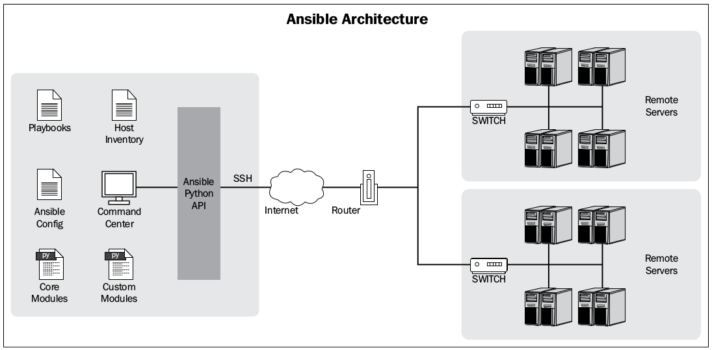

## **Documentation for Ansible 2 (2.4)**

-----
### Mục lục

- [1. Lịch sử IT automation](#history_it_automation)
	* [1.1 IT automation](#it_automation)
	* [1.2 Types of IT automation](#types_of_it_automation)
- [2. Giới thiệu về Ansible](#introduce_ansible)
	* [2.1 Ansible là gì](#what_is_ansible)
	* [2.2 Install Ansible](#install_ansible)
	* [2.3 Getting started](#getting_started)
	* [2.4 Ansible architecture và configuration](#ansible_architecture_and_configuration)
- [3. Playbooks](#playbook)
	* [3.1 Các khái niệm và ví dụ về playbook](#concept_and_introduce_playbook)
	* [3.2 Tính Idempotency của playbook](#idempotency_of_playbook)
	* [3.3 Handler trong playbook](#handler)
- [4. Invetory file](#inventory_file)
	* [4.1 Inventory file là gì](#what_is_inventory_file)
	* [4.2 Các option config trong inventory file](#inventory_options)
	* [4.3 Inventory groups](#inventory_group)
- [5. Include statements](#include_statement)
	* [5.1 Task include với Play include](#task_vs_play_include)
	* [5.2 Dynamic include](#dynamic_include)
- [6. Playbook role](#playbook_roles)
	* [6.1 Ansible galaxy](#ansible_galazy)
	* [6.2 Cấu trúc của role](#struct_of_roles)
	* [6.3 Thực hành với roles trong ansible](#practice_with_roles)
- [7. Variables](#variable)
	* [7.1 Variables trong playbook](#varibales_in_playbook)
	* [7.2 Registering variable](#registering_variable)
- [8. Security management](#security_management)
- [Tài liệu tham khảo](#references)

-------

<a name="history_it_automation"></a>
### **1. Lịch sử IT automation**

<a name="it_automation"></a>
#### **1.1 IT automation**
IT automation trong ngữ cảnh rộng lớn của IT, là các processes và các softwares giúp ta quản lý IT infrastructure (bao gồm các thành phần như: servers, networking, và storage). 
Vào những thời gian đầu của IT, có rất ít các servers và cần rất nhiều sysadmin để quản trị những server đó, thường ít nhất là 2 sysamdin cho mỗi server. Và việc mà các sysadmin phải làm như cài đặt phần mềm, nâng cấp version hay thay đổi các file config đều được thực hiện một cách thủ công. Do đó, việc quản lý tốn rất nhiều công sức và thường dễ xảy ra lỗi, vì vậy nhiều sysadmin đã bắt đầu dùng các scripts để giúp họ dễ dàng quản lý servers hơn. Nhưng các script này vẫn khá phức tạp và được tổ chức chưa tốt.

Khi công nghệ phát triển, các servers cũng trở nên tin cậy, ít lỗi hơn, và dễ dàng để quản lý hơn, các data center phát triển rất nhiều do nhu cầu của các công ty. Và để tốn ít chi phí, các công ty đã sử dụng virtualization, tạo ra hàng loạt các servers giống nhau. Vì vậy, mỗi sysadmin phải quản lý rất nhiều servers cùng lúc, nên cần phải có sự xuất hiện của các **configuration management tools** để thay thế cho các scripts đã được sử dụng trước đó.

CFEngine là tool quản lý cấu hình đầu tiên từ năm 1990, và hiện tại có rất nhiều tools khác hiệu quả và dễ sử dụng hơn như: Puppet, Chef, Salt và Ansible.

<a name="types_of_it_automation"></a>
#### **1.2 Types of IT automation**

Có rất nhiều cách để phân loại IT automation systems, nhưng cách phân loại dựa trên ***"how the configurations are propagated"*** là hay được sử dụng nhất. Dựa trên cách phân loại đó, ta có thể chia ra làm 2 loại là:

- **Agent-based systems**: có 2 components khác nhau là 1 server và 1 client được gọi là agent. Chỉ có 1 server và server đó chứa tất cả cấu hình cho môi trường của bạn, trong khi các agents là rất nhiều các máy tính trong môi trường đó sẽ connect với máy chủ. Trong một số trường hợp cũng có thể có nhiều hơn 1 server để đảm bảo tính high availability, nhưng các máy này phải có cấu hình giống hệt nhau. Các máy client sẽ gửi request định kỳ tới server để kiểm tra xem có cấu hình mới cho client đó hay không. Nếu có thì client sẽ download cấu hình đó về và áp dụng cấu hình đó.
- **Agent-less systems**: trong agent-less systems không có agent cụ thể nào, và agent-less systems không thực hiện đúng theo mô hình server/client mà có rất nhiều servers, thậm chí số lượng servers có thể bằng số lượng client. Việc giao tiếp sẽ được bắt đầu từ phía server khi muốn áp dụng configutations mới cho 1 hoặc nhiều client thông qua các standard protocols (thường là SSH và PowerShell).

Ngoài ra, đánh giá mức độ bảo mật giữa 2 mô hình trên thì agent-based system sẽ kém bảo mật hơn. Do tất cả các máy đều được kết nối với server chứa toàn bộ config nên server này sẽ dễ bị tấn công hơn. Còn trong mô hình agent-less systems khả năng tấn công thấp hơn do các máy có firewall sẽ không chấp nhận bất kì connection nào.
Agent-less system dễ dàng hơn để tích hợp với 1 cơ sở hạ tầng đã có, do các máy tính trong cơ sở hạ tầng đó sẽ được coi như là các máy clients và chỉ cần thực hiện kết nối SSH tới để triển khai cấu hình mà không cần phải thêm các cấu hình bổ sung như việc thực hiện connection client/server như trong agent-base system.

<a name="introduce_ansible"></a>
### **2. Giới thiệu về Ansible**

<a name="what_is_ansible"></a>
#### **2.1 Ansible là gì**
Ansible là 1 agent-less IT automation tool được phát triển bởi ***Michael DeHaan*** năm 2012. Ansible được tạo ra với mục đích là: minimal, consistent, secure, highly reliable and easy to learn.

Ansible chủ yếu chạy trong chế độ push sử dụng SSH, nghĩa là ta sẽ push các configurations từ server tới các agent. Nhưng ta cũng có thể chạy ansible sử dụng **ansible-pull**, nghĩa là ta có thể cài đặt ansible lên mỗi agent, sau đó download các playbook từ server về và chạy khi có 1 số lượng lớn các máy tính (số lượng lớn này là bao nhiêu thì tùy thuộc, nhưng ở đây là nhiều hơn 500 máy)  và các updates cần thực hiện song song.

<a name="install_ansible"></a>
#### **2.2 Cài đặt ansible**

Trong tài liệu này sẽ hướng dẫn cài đặt đơn giản ansible trên môi trường Ubuntu version 14.04.

Thông qua Apt:
```sh
$ sudo apt-get install ansible
```

Thông qua pip:

```sh
$ sudo pip install ansible
```

Kiểm tra version đã cài đặt thành công:

```sh
$ ansible --version
```

<a name="getting_started"></a>
#### **2.3 Getting started**

Thực hiện theo link tại [đây](http://docs.ansible.com/ansible/intro_getting_started.html)


<a name="ansible_architecture_and_configuration"></a>
#### **2.4 Ansible architecture và configuration**



Như ta đã thấy trong hình trên, ý tưởng chính của ansible đó là có 1 hoặc nhiều các trung tâm điều khiển (command center trong hình) từ nơi mà ta có thể phát ra các lệnh hoặc 1 tập lệnh thông qua playbook để chạy trên các remote servers.

Host inventory file là file chứa thông tin của các remote server, nơi mà các plays (sẽ được giới thiệu trong phần 3) sẽ được thực thi. Các remote servers phải được cài đặt Python và thư viện **simplejson** trong trường hợp phiên bản python được cài đặt <= 2.5.

File Ansible configutation có thể được customize để phù hợp với các setting trong môi trường của bạn. Một ansible configuration file sử dụng định INI để lưu các config. Khi ta chạy 1 ansible command, ansible command đó sẽ tìm file config để thực hiện, tìm theo thứ tự sau:

1. **ANSIBLE_CONFIG**: đầu tiên, Ansible command sẽ kiểm tra các biến môi trường xem có biến môi trường nào trỏ tới file configuration không.
2. **./ansible.cfg**: sau đó, ansible command sẽ tìm xem có file **ansible.cfg** trong thư mục hiện tại hay không.
3. **~/ansible.cfg**: thứ 3, ansible command sẽ tìm file configuration trong thư mục **home** của người dùng.
4. **/etc/ansible/ansible.cfg**: cuối cùng, ansible command sẽ kiểm tra file config mặc định đã có khi ta cài đặt Ansible thông qua package manager như pip hay apt/yum.

Trong trường hợp bạn cài ansible thông qua repo trên github thì file **ansible.cfg** sẽ nằm trong thư mục maf bạn đã clone Ansible repository về.

Bây giờ ta cùng tìm hểu 2 cách để configuration ansible, đó là dùng các biến môi trường và sử dụng file ansible.cfg.

**Config sử dụng các biên môi trường**
Ta có thể sử dụng hầu hết các configuration parameters trực tiếp thông qua các biên môi trường bằng cách thêm tiền tố **ANSIBLE_** ở đầu mỗi parameter (tên parameters phải là chữ hoa). Ví dụ như:

```sh
$ export ANSIBLE_SUDO_USER=root
```
Bây giờ, biến **ANSIBLE_SUDO_USER** có thể được sử dụng như là 1 phần của các playbook.

**Configuration sử dụng ansible.cfg**

Ansible có rất nhiều các configuration parameters, nhưng ta sẽ không đề cập đến tất cả mà chỉ đề cập tới các paramerter hay được sử dụng dưới đây:

- **hostfile**: chỉ ra đường dẫn của inventory file. 
- **library**: bất cứ khi nào ta yêu cầu ansible thực hiện 1 hành động nào đó,  dù cho đó là 1 hành động trên local hay tới 1 remote server, thì ansible cũng đều phải sử dụng 1 module nào đó để thực hiện. Parameter **library** sẽ chỉ tới đường dẫn của thư mục chứa các Ansible module. Ví dụ như: `library = /usr/share/ansible`.
- **forks**: số lượng process mặc định mà ta muốn Ansible thực hện song song, mặc định `forks=5`, có nghĩa là nếu ta muốn thực thi 1 task trên 10 remote servers thì ansible sẽ sinh ra 5 process để yêu cầu thực hiện task trên 5 remote servers cùng lúc, còn 5 servers còn lại sẽ phải đợi khi process yêu cầu thực hiện task được giải phóng thì ansible mới thực hiện tiếp task đó trên các server còn lại.
- **sudo_user**: chỉ định user mặc định ***should be used against the issued commands***.
- **remote_port**: sử dụng để chỉ định port cho SSH connection, mặc định là 22.
- **host_key_checking**: được dùng để disable việc kiểm tra SSH host key, mặc định là True.
- **timeout**: là giá trị cho timeout của SSH connection, mặc định là 60s.
- **log_path**: theo mặc định thì ansible không log lại gì, nhưng nếu ta muốn đưa output của Ansible vào 1 logfile thì ta có thể sử dụng parameter **log_path** chỉ tới đường dẫn của file mà ta muốn lưu log.

<a name="playbook"></a>
### **3. Playbook**

**(Lưu ý: các ví dụ về playbook dưới đây đều chạy trên remote host là Centos 7)**

<a name="concept_and_introduce_playbook"></a>
#### **3.1 Các khái niệm và ví dụ về playbook**

Playbook là 1 file được định dạng bằng YAML format, có cú pháp đơn giản để không bị biến thành 1 ngôn ngữ lập trình hay script phức tạp. Trong ansible, playbook thực ra chính là các đoạn script đơn giản, 1 playbook miêu tả những hosts nào được config, và 1 danh sách các tasks hoặc command mà ta sẽ được thực hiện trên những host đó.

Mỗi playbook bao gồm 1 hoặc nhiều **'plays'** trong 1 list. Mỗi play phải chứa các thành phần sau:

- 1 list các hosts để configure
-  1 danh sách các tasks để thực thi trên các hosts trong list trên

Mục đích của play là map host hoặc 1 nhóm các host với 1 số roles xác định, mỗi role sẽ thực hiện các task nào đó. Ở mức độ cơ bản, 1 task đơn giản chỉ là 1 lời gọi tới 1 ansible module. Modules (còn được gọi là **'task plugins'** hay **'library plugins'**) là nơi thực hiện các công việc thực sự trong ansible, chúng là những gì được thực hiện trong mỗi playbook task.

Ví dụ dưới đây cho ta thấy cách thực hiện 3 modules khác nhau từ command line:

```sh
ansible webservers -m service -a "name=httpd state=started"
ansible webservers -m ping
ansible webservers -m command -a "/sbin/reboot -t now"
```

Mỗi module sẽ có các tham số truyền vào là khác nhau, và hầu như tất cả các module đều có tham số theo dạng ***key=value***, các tham số cách nhau bởi dấu cách. Ngoài ra cũng có 1 số module không có tham số như ping...

Trong playbook, các Ansible modules được sử dụng 1 cách vô cùng đơn giản trong task như sau:
```sh
- name: reboot the servers
  command: /sbin/reboot -t now
```
Trong ví dụ trên, ta đã sử dụng module **command** của ansible để thực hiện câu lệnh restart lại remote host.

Một cách khác để truyền tham số vào 1 module là sử dụng cú pháp YAML, còn được gọi là **'complex args'**, như sau: 
```sh
- name: restart webserver
  service:
    name: httpd
    state: restarted
```
Tất cả các modules đều trả về output dưới dạng JSON format. Hiện tại có khoảng 200 modules trong ansible. Dưới đây là một số modules cơ bản trong ansible là: 

- **yum**: dùng để cài đặt hoặc remove các package sử dụng apt package manager
- **copy**: thực hiện copy 1 file từ máy local tới các máy hosts
- **file**: set các thuộc tính cho 1 file, symlink hay 1 thư mục.
- **service**: start, stop or restart 1 service.
- **template**: generate 1 file từ 1 template và copy file đó tới các máy hosts.
- **shell**
- **command**
- **debug**
- ...

(Xem tất cả các moduele của ansible tại [đây](http://docs.ansible.com/ansible/latest/list_of_all_modules.html))

Quay lại với playbook, bây giờ ta cùng tìm hiểu ví dụ cụ thể về playbook để xem cấu trúc của 1 playbook như nào và ansible sẽ chạy các task trong playbook ra sao. 

Đầu tiên ta cần tạo ra 1 thư mục /playbooks có cấu trúc như sau:

```sh
/playbooks
	whoami.yml
	hosts
```

File hosts sẽ lưu các hosts hoặc các group host mà ta muốn configure, có nội dung như sau:
```sh
vm1 ansible_host=192.168.122.140 ansible_ssh_user=vm1
```

(Ip của host và user là tùy thuộc vào máy client bạn tạo ra để test)

File **whoami.yml** có nội dung như sau:
```sh
- name: show return value of command module
  hosts: vm1
  tasks:
    - name: capture output of whoami command
      command: whoami
      register: login
    - debug: msg="{{ login.stdout }} is result of command whoami"
```
Ví dụ trên, 1 play được tạo ra để map host có tên là vm1 trong file /playbooks/hosts thực hiện task là đưa ra teên của user hiện tại mà ta dùng để ssh vào remotehost.  Trong đó, 

- hosts: nơi liệt kê host hoặc tên nhóm các hosts mà ta muốn thực hiện các task trong mục **tasks**. Trường hosts này là bắt buộc đối với mỗi playbook. Khi thực hiện playbook, ansible sẽ lấy tên host hoặc host group mà ta khai báo trong option hosts này, sau đó tìm trong **invetory file** (là file để khai báo các host và group hosts, giống như file hosts phía trên - ta sẽ tìm hiểu trong các phần sau), nếu như không có host hoặc goup host nào khớp với host hoặc group hosts mà ta đã khai báo trong playbook thì ansible sẽ bỏ qua tất cả các task trong playbook đó.
- tasks: là 1 danh sách các hành động mà bạn muốn thực hiện. Trường tasks này bao gồm các thành phần: tên của task (name), các module sẽ được thực thi (trong ví dụ trên là 2 module command và debug), và các tham số cần thiết cho các module đó.

Để chạy file playbook.yml, ta thực hiện câu lệnh dưới và sẽ thu được kết quả như sau:

```sh
donghm@donghm:~/playbooks$ ansible-playbook -i hosts whoami.yml 

PLAY [show return value of command module] *******************************************************************************************************************************

TASK [Gathering Facts] ***************************************************************************************************************************************************
ok: [vm1]

TASK [capture output of whoami command] **********************************************************************************************************************************
changed: [vm1]

TASK [debug] *************************************************************************************************************************************************************
ok: [vm1] => {
    "msg": "vm1 is result of command whoami"
}

PLAY RECAP ***************************************************************************************************************************************************************
vm1                        : ok=3    changed=1    unreachable=0    failed=0   
```
Bây giờ ta cùng đi phân tích output của ansibe. Như trong output trên, ta thấy rằng 2 task có tên là **capture output of whoami command** và **debug** mà ta đã định nghĩa trong playbook đã được thực hiện thành công. Nhưng trước khi thực hiện 2 task này, ansible đã thực hiện 1 task có tên là **Gathering Facts**. Khi Ansible bắt đầu thực thi 1 play, ansible sẽ thực hiện task có tên là **Gathering Facts** này trước tiên để thu thập thông tin về các server mà nó sẽ connect tới như:  hệ điều hành, hostname, IP, địa chỉ MAC của tất cả các interfaces... Do đó, ta có thể tận dụng thông tin này trong playbook, ví dụ như cần địa chỉ IP để cấu hình,... Cách lấy và sử dụng các thông tin này sẽ được trình bày ở phần **varibales**. 

Một điểm cần lưu ý nữa trong output trên đó là **changed=1**,  đây là tổng số lượng task trong play có tác động làm xảy ra thay đổi nào đó trên remote host, ví dụ như: các thay đổi về cài đặt hoặc xóa package, thêm sửa xóa file, hoặc đơn giản là thực hiện câu lệnh echo. Một số trường hợp task thực hiện xong không có cờ changed này do không làm thay đổi gì trên hệ thống của remote host như ping hoặc debug như phía trên.

Về cơ bản, khi ta chạy câu lệnh ***ansible-playbook -i hosts whoami.yml***, với **mỗi task** trong file whoami.yml, ansible sẽ thực hiện các bước sau:

1. Generate các task ra thành 1 Python script để thực hiện
2. Copy Python script đã được generate ở bước 1 tới các host trong group được config
3. Thực hiện script trên tất cả các host trong group
4. Chờ cho tới khi script được thực hiện xong trên tất cả các host.

Sau đó, ansible sẽ chuyển tới task tiếp theo trong danh sách và thực hiện tiếp theo 4 bước trên. Từ đây ta có thể rút ra rằng:

- Ansible chạy mỗi task song song trên tất cả các host.
- Ansible chờ cho tới khi tất cả các host thực hiện xong 1 task nào đó rồi mới chuyển sang task tiếp theo.
- Ansible chạy các task theo thứ tự mà ta chỉ định.

<a name="idempotency_of_playbook"></a>
#### **3.2 Tính Idempotency của playbook**

**Idempotent** là 1 khái niệm có ý nghĩa là ta có thể làm gì đó nhiều lần nhưng kết quả luôn là giống nhau. Trong ansible, 1 playbook được xem xét là có tính idempotent nếu sau lần đầu tiên chạy playbook đó, remotehost sẽ ở 1 trạng thái nào đó thì sẽ vẫn giữ trạng thái đó sau những lần chạy playbook đó tiếp theo. Ví dụ ta tạo 1 file playbook khác có tên là playbook.yml có task thực cài đặt gói HTTPd như sau:

```sh
- hosts: vm1
  remote_user: vm1
  tasks:
    - name: Ensure the HTTPd package is installed
      yum:
        name: httpd
        state: present
      become: True
    - name: Ensure the HTTPd service is enabled and running
      service:
        name: httpd
        state: started
        enabled: True
      become: True
```

Trong play trên, ta đã sử dụng thêm option **become: True** trong mỗi task để yêu cầu quyền **root** khi thực hiện task này (giống như khi chạy câu lệnh có thêm **sudo** phía trước), do việc cài đặt và kiểm tra status của 1 service cần quyền root. Lưu ý là trên remote host, ta cũng phải cấp quyền root cho user vm1, đồng thời khai báo thêm mật khẩu để ansible có thể thực hiện với quyền root, bằng cách thêm **ansible_sudo_pass=YOUR_PASS** trong file hosts:

```sh
vm1 ansible_host=192.168.122.140 ansible_ssh_user=vm1 ansible_sudo_pass=1111
```

Lần đầu tiên khi ta chạy playbook trên, ansible sẽ đánh giá (evaluated) playbook đó và kiểm tra host vm1 của ta để chắc chắn gói HTTPd đã được cài đặt hay chưa. Dưới đây là output sau lần chạy đầu tiên, khi trên vm1 chưa được cài đặt package HTTPd:

```sh
donghm@donghm:~/playbooks$ ansible-playbook -i hosts playbook.yml 

PLAY [vm1] ***************************************************************************************************************************************************************

TASK [Gathering Facts] ***************************************************************************************************************************************************
ok: [vm1]

TASK [Ensure the HTTPd package is installed] *****************************************************************************************************************************
changed: [vm1]

TASK [Ensure the HTTPd service is enabled and running] *******************************************************************************************************************
changed: [vm1]

PLAY RECAP ***************************************************************************************************************************************************************
vm1                        : ok=3    changed=2    unreachable=0    failed=0 
```
Ta thấy 2 task trong playbook.yml là cài đặt gói httpd và start httpd này đã được thực hiện thành công, nhưng để chắc chắn, ta sẽ ssh vào vm1 để kiểm tra xem httpd đã được cài đặt thành công và start thực sự hay chưa, bằng cách thực hiện lệnh sau:

```sh
[vm1@localhost ~]$ rpm -qa | grep httpd
httpd-tools-2.4.6-45.el7.centos.4.x86_64
httpd-2.4.6-45.el7.centos.4.x86_64
[vm1@localhost ~]$ sudo service httpd status
Redirecting to /bin/systemctl status  httpd.service
● httpd.service - The Apache HTTP Server
   Loaded: loaded (/usr/lib/systemd/system/httpd.service; enabled; vendor preset: disabled)
   Active: active (running) since T3 2017-07-18 13:42:16 ICT; 7min ago
     Docs: man:httpd(8)
           man:apachectl(8)
 Main PID: 19534 (httpd)
   Status: "Total requests: 0; Current requests/sec: 0; Current traffic:   0 B/sec"
   CGroup: /system.slice/httpd.service
           ├─19534 /usr/sbin/httpd -DFOREGROUND
           ├─19535 /usr/sbin/httpd -DFOREGROUND
           ├─19536 /usr/sbin/httpd -DFOREGROUND
           ├─19537 /usr/sbin/httpd -DFOREGROUND
           ├─19539 /usr/sbin/httpd -DFOREGROUND
           └─19540 /usr/sbin/httpd -DFOREGROUND

Th07 18 13:42:16 localhost.localdomain systemd[1]: Starting The Apache HTTP Server...
Th07 18 13:42:16 localhost.localdomain httpd[19534]: AH00558: httpd: Could not reliably determine the server's fully qualified domain name, using localhost.lo...s message
Th07 18 13:42:16 localhost.localdomain systemd[1]: Started The Apache HTTP Server.
```

Nếu có output tương tự như trên nghĩa là playbook đã chạy đúng.

Còn dưới đây là output khi ta chạy lại playbook đó lần 2:

```sh
donghm@donghm:~/playbooks$ ansible-playbook -i hosts playbook.yml 

PLAY [vm1] ***************************************************************************************************************************************************************

TASK [Gathering Facts] ***************************************************************************************************************************************************
ok: [vm1]

TASK [Ensure the HTTPd package is installed] *****************************************************************************************************************************
ok: [vm1]

TASK [Ensure the HTTPd service is enabled and running] *******************************************************************************************************************
ok: [vm1]

PLAY RECAP ***************************************************************************************************************************************************************
vm1                        : ok=3    changed=0    unreachable=0    failed=0 
```
Trong output của cả 2 lần, có thể thấy rằng trong task **[Ensure the HTTPd package is installed]**, ở lần đầu tiên thực hiện do gói HTTPd chưa được cài đặt nên ansible sẽ thực hiện script để cài đặt gói đó trên vm1, dó đó cờ **changed: [vm1]** xuất hiện, nhưng trong lần 2 do gói HTTPd đã được cài đặt thành công nên apt module của ansible sẽ không tiến hành cài đặt gói HTTPd này nữa, thay vào đó cờ **ok: [vm1]** xuất hiện thể hiện gói này đã được cài thành công. Trong task **[Ensure the HTTPd service is enabled and running]** cũng tương tự, do httpd đã start rồi nên ansible cũng sẽ không làm gì nữa. 

Từ đó ta có thể nói rằng playbook này có tính **idempotency**.

<a name="handler"></a>
#### **3.3 Handler trong playbook**
Handler có chức năng giống như 1 task, 
```sh
handlers:
   - name: restart nginx
     service: name=nginx state=restarted
```
nhưng chỉ xảy ra khi có điều kiện nào đó. Handler được run khi được notified bởi 1 task. Một task sẽ kích hoạt notification nếu Ansible phát hiện ra task đó đã thay đổi state của hệ thống, notify của 1 task được khai báo như sau:

```sh
- tasks:
   - name: copy TLS key
     copy: src=files/nginx.key dest={{ key_file }} owner=root mode=0600
     notify: restart nginx
```

Mốt số điều cần lưu ý về handlers, đó là các handlers chỉ run sau khi tất cả các task đã được hoàn thành,  và chỉ **run đúng 1 lần**, ngay cả khi chúng được notify nhiều lần. Các handler luôn **run theo thứ tự mà chúng xuất hiện trong play** chứ không run theo thứ tự notification. Docs của ansible khuyên ta chỉ nên sử dụng các handler để thực hiện việc restart service hoặc reboots. 

<a name="inventory_file"></a>
### **4. Inventory file**

<a name="what_is_inventory_file"></a>
#### **4.1 Invenroty file là gì**

Inventory file là file chứa các thông tin về hosts mà ta sẽ thực hiện các task trên đó, file hosts ta đang làm việc chính là 1 inventory file. Theo mặc định, ansible sẽ coi file có **/etc/ansible/hosts** là inventory file mặc định. Nhưng việc ta không nên sử dụng file mặc định này, mà nên tạo các inventory file khác nhau cho mỗi project, sau đó ta có thể truyền vào khi chạy câu lệnh **ansible** với option **-i**như:

```sh
$ ansible all -i /path/to/inventory -m ping
```
 hoặc câu lệnh **ansible-playbook** cũng với option **-i** như các ví dụ mà ta đã chạy bên trên.

Inventory file có thể là 1 file JSON hoặc INI file. Nhưng hầu hết các trường hợp thì ta thường dùng INI file vì nó có cấu trúc vô cùng đơn giản (ví dụ như file hosts bên trên). Ta chỉ dùng JSON khi inventory file cần được generate động (sẽ được trình bày trong phần 4.2). Dưới đây là 1 ví dụ đơn giản về inventory file:

```sh
host1.example.com
host2.example.com
host3.example.com
192.168.9.29
```
Trong ví dụ trên, chúng ta định nghĩa 1 danh sách các host để chạy, và không có thêm thông tin gì khác về các host. Nếu muốn chạy SSH trên port khác port mặc đinh (port 22), ta có thể chỉ định trong invetory file như sau:

```sh
host1.example.com:50822
```
Ngoài ra có 1 số mẹo khi bạn cần làm việc với 1 số lượng lớn servers có tên tương tự nhau, chỉ khác nhau về số, ví dụ host1, host2, ... , host100, bạn có thể dùng **rangers** trong inventory file thay vì phải liệt kê đủ từng host bằng tay. Ví dụ:

```sh
host[1:3].example.com
```
Khi  bạn khai báo như kia trong inventory file thì các host sau sẽ hợp lệ khi bạn truy cập tới:
```sh
host1.example.com
host2.example.com
host3.example.com
```

Ngoài ra, ranger trong inventory file còn hỗ trợ cả ranger theo thứ tự **[a-z]** hoặc ranger số có số 0 đứng đầu như **[01-05]**. Nhưng cần lưu ý là ansible không hỗ trợ ranger theo **[aa-az]**. Nếu trong trường hợp bạn muốn ranger theo **[aa-az]** thì bạn có thể sử dụng cách kết hợp 2 rangers như sau:
```sh
host[a:d][a:z].example.com
```
Ngoài ra ansible cũng hỗ trợ ranger theo cú pháp slice của Python:

```sh
host[min:max:step].example.com
```
Ví dụ như:

```sh
host[1:6:2].example.com 
```
sẽ có các host hợp lệ là

```sh
host1.example.com
host3.example.com
host5.example.com
```

Ngoài việc sử dụng ranger với tên của các host, ta còn có thể sử dụng varibale cho tên của group các hosts. Ví dụ như:

```sh
[web:vars]
apache_version=2.4
engage_flibbit=true
```
Biến vars này sẽ được truyền vào là variable trong ansible playbook.

<a name="inventory_options"></a>
#### **4.2 Các option config trong inventory file**

Trong ví dụ ở phần playbook, để có thể làm việc với host vm1, ta đã phải set 2 option là **ansible_hosts, ansible_ssh_user và ansible_sudo_pass** để ansible có thể biết địa chỉ của host, user sẽ login vào và mật khẩu để chạy với quyền root. Nhưng ngoài các parameter này, inventory còn nhiều các parameter khác. Dưới đây là chi tiết về các parameters trong inventory file.

Parameters chung cho toàn bộ các connections:

- **ansible_host**: cho phép ta sử dụng 1 tên khác để làm việc với host, thay vì sử dụng ip hoặc hostname trong các playbook. Điều này giúp ta không phải thay đổi tên host trong các playbook khi ip hay hostsname của nó thay đổi. Ví dụ: `vm1 ansible_host=192.168.122.140`
- **ansible_user**: user để login vào remote host thông qua SSH. Ví dụ `ansible_user=vm1` sẽ tương đương với `ssh vm1@192.168.122.140`
- **ansible_port**: port mà SSH server lắng nghe trên remote host. Ta cũng có thể sử dụng thông qua bí danh bằng cách `hostname:port`

Các parameters để chỉ định cho SSH connection:

- **ansible_ssh_private_key_file**: SSH key file được sử dụng để log in. Ví dụ: `ansible_ssh_private_key_file=/path/to/id_rsa` tương đương với `ssh -i /path/to/id_rsa`
- **ansible_ssh_pass**: nếu user mà ta đang sử dụng để connect tới remote host yêu cầu password. Nhưng sử dụng option này không đảm bảo tính an toàn, do đó bạn nên sử dụng SSH key hoặc sử dụng cờ `ask-pass` trong command line để chỉ cung cấp pass ở thời điểm run time.
- **ansible_ssh_common_args**: 
- **ansible_sftp_extra_args**:
- **ansible_scp_extra_args**:
- **ansible_ssh_executable**: This setting overrides the default behavior to use the system ssh.

Thêm quyền cho user connect:

- **ansible_become**: tương đương với **ansible_sudo** hoặc **ansible_su**, cho phép user hiện tại sử dụng quyền sudo hoặc su.
- **ansible_become_method**: method được dùng để chạy với quyền superuser. Mặc định là **sudo**, nhưng ta cũng có thể chỉnh lại thành **su, pbrun, pfexec, hoặc doas**.
- **ansible_become_user**: mặc định **become** sẽ đưa bạn đến quyền root, tương đương với **ansible_sudo_user** hay **ansible_su_user**. Nhưng nếu bạn có 1 user khác có quyền để thực hiện task bạn đang muốn chạy và bạn muốn có quyền như user đó, thay vì root thì bạn có thể dùng **ansible_become_user**. Option này tương đương với việc sử dụng cờ **-u** khi run command line, ví dụ: `sudo -u myusser command`.
- **ansible_become_pass**: cho phép set password để có quyền của user trong ansible_become_user, nhưng ta không nên sử dụng vì tính bảo mật.

Các paremeters để điều chỉnh remote host environment:
 
 - **ansible_shell_type**: 
 - **ansible_python_interpreter**:

<a name="inventory_group"></a>
#### **4.3 Inventory groups**

Từ đầu tới giờ ta mới chỉ làm việc với 1 remote host đơn lẻ. Điều này là không phù hợp với công việc quản lý trong thực tế. Ví dụ như khi ta muốn triển khai 1 hệ thống gồm nhiều máy, và mỗi một nhóm các máy sẽ đảm nhiệm một chức năng như: webserrvers, database, load balancers... Để có thể thực hiện các task trên các nhóm máy cùng lúc, inventory đã cung cấp khái niệm là inventory group để ta có thể gom nhóm các máy thực hiện chung 1 công việc vào 1 biến trong inventory file. 

Để tạo ra 1 nhóm trong inventory file có định dạng INI, ta chỉ cần khai báo hết sức đơn giản như sau:

```sh
[web]
host1.example.com
host2.example.com

[database]
db.example.com
```
Trong ví dụ về inventory file trên, chúng ta có 2 host trong group **web** và 1 host trong group **database**. Bây giờ, chúng ta có thể khai báo các group này trong các playbook của chúng ta để thực hiện các task tương ứng. 

Ngoài ra, trong ansible có 2 group mặc định đó là:

- **all**: chứa tất cả các host
- **ungrouped**: chứa tất cả các host không thuộc group nào.

**Lưu ý:**  **host variable** sẽ override **group variable** trong trường hợp chúng cùng tên trong cùng 1 spaces.

##### **Dynamic inventories**

Khi làm việc với số lượng server quá lớn, lên đến hàng trăm, nghìn hay chục nghìn server thì ta không thể sử dụng các static text file để làm inventory file được. Thay vào đó, ta nên sử dụng các file có cấu trúc để lưu trữ như exel hay 1 file database nào đó. 

Ansible hỗ trợ khái niệm là **dynamic inventory**, trong đó inventory file là 1 JSON file chứa toàn bộ dữ liệu về các hosts. Việc này giúp ta có thể sourced inventory file từ bất kì đâu: file lưu trữ trên máy local, hoặc từ file database, hoặc get về từ 1 remote api như từ 1 cloud provider, LDAP, Cobbler,...

Đọc tiếp để docs tại [đây](http://docs.ansible.com/ansible/intro_dynamic_inventory.html)

<a name="include_statement"></a>
### **5. Include statement**

<a name="task_vs_play_include"></a>
#### **5.1 Task include với Play include**

Tasks và plays đều có thể sử dụng từ khóa **include**, nhưng cách thực hiện lại khác nhau. Sự khác nhau là từ vị trí và nội dung trong từ khóa **include**. Nếu từ khóa include được đặt trong 1 play thì nó chỉ có thể dùng để include 1 task hoặc 1 danh sách các task. Còn nếu từ khóa include nằm ở bên ngoài các play thì nó chỉ có thể dùng để include các plays khác. Ví dụ về 1 playbook trong file testIncludeStatement.yml có nội dung như sau:
```sh
- name: another play
  hosts: vm1
  tasks:
    - debug: msg='hello dong'
    # this is a task include
    - include: tastInclude.yml

# this is a play include
- include: whoami.yml
```

Trong đó, nội dung của file tastInclude.yml sẽ chứa các task, ví dụ đơn giản như:
```sh
- debug: msg='this is task was included'
```
Còn nội dung của file whoami.yml sẽ là các play khác, ví dụ:
```sh
- name: show return value of command module
  hosts: testserver
  tasks:
    - name: capture output of whoami command
      command: whoami
      register: login
    - debug: msg="{{ login.stdout }} is result of command whoami"
```

Và dưới đây là kết qủa thực hiện khi ta chạy playbook testIncludeStatement.yml:

```sh
donghm@donghm:~/playbooks$ ansible-playbook -i hosts testIncludeStatement.yml 

PLAY [test include statement] ********************************************************************************************************************************************

TASK [Gathering Facts] ***************************************************************************************************************************************************
ok: [vm1]

TASK [debug] *************************************************************************************************************************************************************
ok: [vm1] => {
    "msg": "hello dong"
}

TASK [debug] *************************************************************************************************************************************************************
ok: [vm1] => {
    "msg": "this is task was included"
}

PLAY [show return value of command module] *******************************************************************************************************************************

TASK [Gathering Facts] ***************************************************************************************************************************************************
ok: [vm1]

TASK [capture output of whoami command] **********************************************************************************************************************************
changed: [vm1]

TASK [debug] *************************************************************************************************************************************************************
ok: [vm1] => {
    "msg": "root is result of command whoami"
}

PLAY RECAP ***************************************************************************************************************************************************************
vm1                        : ok=6    changed=1    unreachable=0    failed=0 
```

Như ta thấy trong output trên, đó là các task hay play được include vào sẽ được thực hiện theo thứ tự mà chúng được include vào, như trong ví dụ trên thì các task trong file **taskInclude.yml** sẽ được thực hiện sau khi task **debug: msg='hello dong'** thực hiện xong. Còn các play trong file **whoami.yml** sẽ được thực hiện khi play **test include statement** thực hiện xong.

<a name="dynamic_include"></a>
####**5.2 Dynamic include**

Từ các ansible version 2.0 trở về trước thì chỉ có khái niệm là 'static' include trong ansible, giống như ví dụ ta thực hiện bên trên. Điều này làm nảy sinh vấn đề với các variable trong inventory file được sử dụng trong các file include. Đó là các biến group hay host trong invetory file là không khả dụng trong suốt thời gian phân tích cú pháp - parsing time.

Do đó, từ sau phiên bản 2.0 trở đi, có thêm khái niệm mới là **dynamic include**, có nghĩa là các include task sẽ không được phân tích cho tới khi include task được tìm thấy trong thời gian thực thi play. Sự thay đổi này cho phép ta thực hiện vòng lặp trong include statement để include, ví dụ như:

```sh
- include: foo.yml param={{item}}
  with_items:
  - 1
  - 2
  - 3
```

Ngoài ra ta cũng có thể sử dụng các biến được khai báo từ bất kì chỗ nào trong play với dynamic include, ví dụ:

```sh
- include: "{{inventory_hostname}}.yml"
```

Nhưng bên cạnh đó, khi sử dụng dynamic include, do include file sẽ không được đọc cho tới khi include task được tìm thấy trong qúa trình thực thi play, nên ta cần lưu ý một số hạn chế sau:

- Không được sử dụng **notify** để trigger tới 1 handler nằm trong dynamic include.
- Không được sử dụng **--start-at-task** để bắt đầu thực thi từ 1 task bên trong dybamuc include.
- Các tags và các task chỉ tồn tại trong 1 dynamic include sẽ không được hiện thị trong output của **--list-tags**.

<a name="playbook_roles"></a>
### **6. Playbook roles**

Ta đã tìm hiểu về các khái niệm tasks và handers, nhưng làm thế nào để tổ chức tốt và đạt được khả năng tái sử dụng cao các playbook? Câu trả lời là sử dụng roles.

Trong ansible, role là cơ chế chính giúp ta chia 1 playbook phức tạp ra các phần nhỏ hơn để dễ dàng viết cũng như tái sử dụng. Ta có thể coi role giống như việc nhóm các host theo các tác vụ chung, ví dụ như ta thêm webservers role cho các hosts đóng vai trò làm webservers, databases role cho các host đóng vai trò làm database server.

Bây giờ ta cùng đi tìm hiểu về cấu trúc của 1 roles và sử dụng role trong các playbook để thực hiện cài đặt WordPress trên remote server, để xem tính **reusealbe** của role.

<a name="ansible_galazy"></a>
#### **6.1 Ansible galaxy**

Các role là 1 khái niệm trong core của ansible, chúng được thực hiện giống như các core function. Nhưng trong thực tế, chúng còn có repository riêng để chứa và kèm theo các command-line tool. Ansible Galaxy là 1 website để chứa các roles, đồng thời mọi người cũng có thể upload roles của mình lên để mọi người cùng sử dụng và tham khảo. Hiện tại có khoảng hơn 5000 roles đã được up lên, ta có thể lên trang chủ [https://galaxy.ansible.com](https://galaxy.ansible.com) để tải role phù hợp về và sử dụng.

Khi cài đặt 1 roles, ta có thể cài đặt role đó ở global - mọi project đều có thể sử dụng được roles đó, hoặc local đối với 1 project. Tùy thuộc vào yêu cầu của bạn mà có thể chọn chế độ hợp lý, ví dụ trong trường hợp bạn có nhiều project cùng sử dụng 1 role nhưng cần khác version thì bạn phải sử dụng chế độ tải về ở local cho project tương ứng. Để tải về 1 role, ta có thể tìm role đó trên trang chủ, sau đó tải về bằng câu lệnh bên dưới:

```sh
$ ansible-galaxy install -p username.rolename
```

Cờ **-p** có thể có hoặc không. Nếu có thì role tải về sẽ được nằm trong 1 folder tên là **roles**. Và ta nên chạy câu lệnh trên trong cùng thư mục chứa file playbook.yml.  Còn username chính là tên của user đã upload role đó.

Để sử dụng role mới tải về, ta chỉ cần include nó vào trong playbook mà ta muốn dùng.

<a name="struct_of_roles"></a>
#### **6.2 Cấu trúc của role**

Hiện tại, ta đã biết cách tải 1 roles về và chạy nó trong playbook, bây giờ ta sẽ cùng đi tìm hiểu cấu trúc của 1 role gồm những thành phần gì. Để tạo ra 1 role, ta có thể dùng câu lệnh của **ansible-galaxy** để tạo ra 1 role mới, ví dụ dưới đây sẽ tạo ra 1 role có tên là donghm.php, trong đó donghm là tên user, còn php là tên role

```sh
$ mkdir -p ansible_wordPress/roles
$ cd ansible_wordPress/roles
$ ansible-galaxy init donghm.php
```
Bây giờ trong thư mục roles của bạn sẽ có 1 thư mục có tên là donghm.php có cấu trúc như sau:

```sh
common/
	 README.md
     tasks/
     	     main.yml
     handlers/
     	     main.yml
     defaults/
     	     main.yml
     meta/
     	     main.yml
     vars/
		     main.yml
	 test/
			 inventory
			 test.yml
```

Tùy vào mục đích và sự cần thiết, ta có thể tạo ra các file xử lý khác nhau. 7 thư mục trên là do ta sử dụng câu lệnh ansible-galaxy để tạo ra 1 role nên ansible sẽ tạo ra 1 role có đầy đủ các file xử lý. Còn trong thực tế, 1 role không nhất thiết phải có đủ 7 thư mục đó, mà chỉ cần có 1 file /tasks/main.yml cũng vẫn được. 

Bây giờ ta cùng đi tìm hiểu chi tiết các thành phần trong 1 role: 

- **README.md**: mỗi role đều nên có 1 file README.md để diễn tả mục đích của role đó, tại sao role đó được tạo ra thay vì sử dụng 1 tool có sẵn, và các biến sẽ được customize trong role.
- **defaults/main.yml**: là 1 configuration file để ta có thể định nghĩa các **giá trị mặc định cho các biến** được sử dụng trong role. Ta cũng có thể định nghĩa các biến trong **vars/main.yml** để override biến nào đó trong **defaults/main.yml** vì các biến trong **vars/main.yml** có quyền ưu tiên cao hơn. Ví dụ, các biến trong vars/main.yml sẽ override được các biến được định nghĩa trong khi thực hiện task **gathering facts** ở đầu mỗi play, còn các biến trong defaults/main.yml thì không (vấn đề về các biến sẽ được đề cập trong phần 7).
- **handlers/main.yml**: nơi ta sẽ định nghĩa các handler cho các playbook, ví dụ như restart nginx. Việc tập hợp tất cả các handlers cần có trong cùng 1 nơi giúp dễ dàng hơn trong trường hợp ta muốn xem lại đã có các handler nào, và nó thực hiện công việc gì hoặc khi người khác tái sử dụng module của bạn. Các handlers có thể được gọi trong cùng role hoặc từ các roles khác, hoặc từ 1 playbook khác.
- **meta/main.yml**: chứa metadata cho role của bạn. Chứa các thông tin như minimum ansible version, supported platforms, các dependencies, ... cho role trong trường hợp bạn muốn publish module của bạn.  
- **task/main.yml**: đây là nơi ta cần quan tâm nhất của 1 role, chứa các tasks của role. **Tất cả các hành động** được định nghĩa trong file này sẽ được thực thi khi role được chạy.
- **tests**: là thư mục để chứa các test playbooks cho role của bạn. Thư mục này sẽ được sử dụng khi project của bạn tích hợp các tool test project tự động như **Jenkins** hay **Travis CI.A**.

Một điều nữa ta cần chú ý, đó là gần như tất cả các thư mục trong 1 role đều có file **main.yml**. Đây là file mặc định Ansible sẽ load khi ta include 1 role. Ví dụ khi ansible load role PHP mà ta vừa tạo, ansible sẽ load file roles/donghm.php/tasks/main.yml. Do đó ta có thể thêm các task 1 cách trực tiếp vào file này, hiawjc có thể định nghĩa các task trong các file khác, sau đó import vào file main.yml.

<a name="practice_with_roles"></a>
#### **6.3 Thực hành với roles trong ansible**

Sau khi đã tìm hiểu về cách tạo và cấu trúc của 1 role, bây giờ ta sẽ cùng tìm hiểu 1 số ví dụ thực tế về cách sử dụng role để thực hiện cài php, mysql và ngix. Ta thực hiện tạo ra 3 role **php, nginx, và mysql** như sau:

```sh
$ cd /ansible_wordPress/roles
$ ansible-galaxy init donghm.php
$ ansible-galaxy init donghm.nginx
$ ansible-galaxy init donghm.mysql
```

Bây giờ ta cùng quay lại thư mục ansible_wordPress và tạo file playbook.yml để import các role mới tạo vào, như sau:

```sh
- hosts: vm1
  become: true
  roles:
	- donghm.php
	- donghm.nginx
	- donghm.mysql
  tasks:
	- name: Install required packages
	  ping:
```

Ta tạo 1 file inventory file để chứa các thông tin về remote server, có tên là **hosts** với nội dung:

```sh
vm1 ansible_host=192.168.122.140 ansible_ssh_user=vm1 ansible_sudo_pass=1111
```

(Lưu ý: bạn cần chỉnh lại thông tin trên cho phù hợp với remote server của bạn)

Các roles bây giờ vẫn chưa có task nào, do đó nếu như bạn chạy file playbook.yml phía trên thì sẽ không có action nào được thực hiện ngoài task ping.

**donghm.php**

Ta sẽ cùng nhau đi tạo role php trước. Để cài đặt php trên remote server, ta cần thêm 4 task dưới đây vào file **roles/donghm.php/task/main.yml:**

```sh
- name: Install PHP
  apt: name={{item}} state=installed update_cache=yes
  with_items:
    - php
    - php-fpm
    - php-mysql
    - php-xml
```

Ở trong task install php kia, để ý thấy rằng ta đã dùng vòng lặp để cài đặt các package của php, thay vì phải viết nhiều task nhỏ. Cấu trúc của vòng lặp trong ansible đó là sử dụng với cặp từ khóa **item** và **with-item**. Khi có vòng lặp, ansible sẽ thực hiện cài đặt từng package với item tương ứng, điều kiện kết thúc 1 vòng lặp đó là khi **state=installed** (đây là 1 param trong module yum) của  thì mới chuyển sang item tiếp theo.

Sau khi đã viết xong task install php cho role php, bây giờ ta có thể chạy playbook.yml để xem kết quả:

```sh
donghm@donghm:~/ansible_wordPress$ ansible-playbook -i hosts playbook.yml 

PLAY [vm1] ***************************************************************************************************************************************************************

TASK [Gathering Facts] ***************************************************************************************************************************************************
ok: [vm1]

TASK [donghm.php : Install PHP] ******************************************************************************************************************************************
changed: [vm1] => (item=[u'php', u'php-fpm', u'php-mysql', u'php-xml'])

TASK [Install required packages] *****************************************************************************************************************************************
ok: [vm1]

PLAY RECAP ***************************************************************************************************************************************************************
vm1                        : ok=3    changed=1    unreachable=0    failed=0  
```

Nếu có output tương tự như trên nghĩa là ta đã cài đặt thành công PHP trên remote host vm1. Nhưng có 1 điều cần lưu ý ở trong output, đó là tên task đã được gắn kèm theo tên role tương ứng: **TASK [donghm.php : Install PHP]**. Việc thêm tên role này giúp ta có thể tìm được task nào được khai báo trong roles nào 1 cách nhanh chóng. 

Kiểm tra lại trên remote server để xem php đã được cài đặt thành công thực sự chưa:

```sh
[vm1@localhost ~]$ php --version
PHP 5.4.16 (cli) (built: Nov  6 2016 00:29:02) 
Copyright (c) 1997-2013 The PHP Group
Zend Engine v2.4.0, Copyright (c) 1998-2013 Zend Technologies
```

Success! Bây giờ ta đã có 1 role để cài đặt php, do đó mỗi lần cần cài php cho 1 project mới, ta chỉ cần import role php này vào. Bây giờ ta cùng viết tiếp role mysql.

Thêm task có tên Install MySQL trong file **roles/donghm.mysql/task/main.yml:**

```sh
- name: Install MySQL
  yum: name={{item}} state=installed
  with_items:
    - mysql-server
    - MySQL-python

- name: Make sure mysql server start
  service: name=mysql state=restarted
```

Nhưng chỉ với task trên là chưa đủ, tại vì task này chỉ đơn thuần thực hiện việc cài đặt MySQL nhưng chưa có password cho root user, do đó mysql sẽ chuyển quyền truy nhập các test databases sang các anonymous users. Thông thường khi cài đặt MySQL trên máy tính cá nhân, ta thường sử dụng lệnh **mysql_secure_installation** để đặt mật khẩu cho user root và xóa các test database. Nhưng vì đây là thực hiện cài đặt từ xa, thông qua ansible, nên ta phải tự làm các công việc đó bằng tay, bằng cách thêm các task thực hiện các công việc sau:

1. Thay đổi default root password.
2. Remove anonymous users.
3. Remove test database.

Để thay đổi default password, ta cần phải generate 1 pass mới để sử dụng. Trong task dưới đây, ta sẽ sử dụng **openssl** để generate 1 password có 15 kí tự:

```sh
- name: Generate new root password
  command: openssl rand -hex 7
  register: mysql_new_root_pass
```

Trong task trên, ta đã sử dụng module **register** của ansible. Module này giúp ra có thể lưu value return từ command **openssl rand -hex 7** vào trong biến **mysql_new_root_pass** mà ta đã khai báo.

Việc tiếp theo cần làm đó là cần xóa các anonymous users và test database bằng cách sử dụng các module **mysql_db** và **mysql_user**. Ta cần phải thực hiện 2 công việc này trước khi thay đổi root pass để Ansible có thể thực hiện được:

```sh
- name: Remove anonymous users
  mysql_user: name="" state=absent
  
- name: Remove test database
  mysql_db: name=test state=absent
```
 Và việc cuối cùng đó là thay đổi root password và xuất password này ra output thông qua biến **mysql_new_root_pass** ta đã register bên trên. Ta nên set password cho tất cả các hosts có thể truy cập vào mysql với quyền root, để thực hiện việc đó, ta lại sử dụng **vòng lặp** như sau:

```sh
- name: Update root password
  mysql_user: name=root host={{item}} password={{mysql_new_root_pass.stdout}}
  with_items:
    - "{{ ansible_hostname }}"
    - 127.0.0.1
    - ::1
    - localhost

- name: Output new root password
  debug: msg="New root password is {{mysql_new_root_pass.stdout}}"
```

Bây giờ ta sẽ chạy lại playbook để xem kết quả:

```sh
donghm@donghm:~/ansible_wordPress$ ansible-playbook -i hosts playbook.yml 

PLAY [vm1] ***************************************************************************************************************************************************************

TASK [Gathering Facts] ***************************************************************************************************************************************************
ok: [vm1]

TASK [donghm.php : Install PHP] ******************************************************************************************************************************************
ok: [vm1] => (item=[u'php', u'php-fpm', u'php-mysql', u'php-xml'])

TASK [donghm.mysql : Install MySQL] **************************************************************************************************************************************
changed: [vm1] => (item=[u'mysql-server', u'MySQL-python'])

TASK [donghm.mysql : Make sure mysql server start] ***********************************************************************************************************************
changed: [vm1]

TASK [donghm.mysql : Generate new root password] *************************************************************************************************************************
changed: [vm1]

TASK [donghm.mysql : Remove anonymous users] *****************************************************************************************************************************
changed: [vm1]

TASK [donghm.mysql : Remove test database] *******************************************************************************************************************************
ok: [vm1]

TASK [donghm.mysql : Update root password] *******************************************************************************************************************************
changed: [vm1] => (item=[u'localhost', u'127.0.0.1', u'::1', u'localhost])

TASK [donghm.mysql : Output new root password] ***************************************************************************************************************************
ok: [vm1] => {
    "msg": "New root password is 901aa00ed094ff"
}

TASK [Install required packages] *****************************************************************************************************************************************
ok: [vm1]


PLAY RECAP ***************************************************************************************************************************************************************
vm1                        : ok=10    changed=5    unreachable=0    failed=0
```

Nếu như có output như trên nghĩa là ta đã thực hiện thành công các việc: cài đặt MySQL, xóa các anonymous users, xóa test database, generate root password mới và in password mới đó ra output. 

Nhưng các module mysql của ansible viết ra để thực hiện các database command mà không cần mật khẩu. Do đó ta cần tạo 1 file config (nằm ở đường dẫn **/root/.my.cnf**) chứa root password của MySQL để root user có thể chạy các câu lệnh MySQL 1 cách tự động. Ta có thể sử dụng một số ansible module như **copy, template** để tạo ra 1 file. Nhưng do đây là 1 file có nhiều dòng chứa các biến, nên ta sẽ sử dụng module **template**. 

Đầu tiên ta cần tạo 1 templates folder trong role mysql để chứa template file bằng câu lệnh sau:

```sh
$ mkdir -p roles/donghm.mysql/templates
$ touch roles/donghm.mysql/templates/my.cnf
```

Sau đó chỉnh sửa file **my.cnf** để có nội dung sau:

```sh
[client]
user=root
password={{ mysql_new_root_pass.stdout }}
```

Sau khi đã định nghĩa xong file template, ta cần thêm task để copy file template này tới remote server:

```sh
- name: Create my.cnf
  template: src=my.cnf dest=/root/.my.cnf
```

Có 1 điều cần lưu ý, đó là mỗi lần role **mysql** này chạy thì remote server của ta sẽ lại generate ra 1 password mới do chạy lại task **Generate new root password**. Để tránh việc này, ta sẽ sử dụng module **creates** của Ansible để Ansible sẽ không run 1 command nào đó nếu đã tồn tại 1 file mà ta chỉ định (ở đây là file **.my.cnf**), do đó ta sẽ chỉnh lại task **Generate new root password** thành như sau:

```sh
- name: Generate new root password
  command: openssl rand -hex 7 creates=/root/.my.cnf
  register: mysql_new_root_pass
```

Nếu file **/root/.my.cnf** không tồn tại thì biến **mysql_new_pass** sẽ có attribute **changed=true**, còn nếu file này đã tồn tại thì **mysql_new_pass.changed=false**. Lợi dụng thuộc tính này, ta sẽ thay đổi lại task **debug** để in ra thông tin phù hợp, bằng cách sử dụng từ khóa **điều kiện (when)** trong ansible, như sau:

```sh
# If /root/.my.cnf doesn't exist and the command is run
- debug: msg="New root password is {{    mysql_new_root_pass.stdout }}"
  when: mysql_new_root_pass.changed
  
# If /root/.my.cnf exists and the command is not run
- debug: msg="No change to root password"
  when: not mysql_new_root_pass.changed
```

Cuối cùng, file **ansible_wordPress/roles/donghm.mysql/tasks/main.yml** của ta sẽ có nội dung như sau:

```sh
- name: Install MySQL
  apt: name={{item}} state=installed
  with_items:
    - mysql-server
    - MySQL-python

- name: Generate new root password
  command: openssl rand -hex 7 creates=/root/.my.cnf
  register: mysql_new_root_pass

- name: Make sure mysql server start
  service: name=mysql state=restarted

- name: Remove anonymous users
  mysql_user: name="" state=absent
  when: mysql_new_root_pass.changed
  
- name: Remove test database
  mysql_db: name=test state=absent
  when: mysql_new_root_pass.changed
  
- name: Output new root password
  debug: msg="New root password is {{mysql_new_root_pass.stdout}}"
  when: mysql_new_root_pass.changed

- name: Update root password
  mysql_user: name=root host={{item}} password={{mysql_new_root_pass.stdout}}
  with_items:
    - "{{ ansible_hostname }}"
    - 127.0.0.1
    - ::1
    - localhost
  when: mysql_new_root_pass.changed
 
- name: Create file my.cnf
  template: src=my.cnf dest=/root/.my.cnf
  when: mysql_new_root_pass.changed
```

**donghm.nginx**

Ta cần thực hiện cài đặt và configure **nginx** trước khi có thể cài đặt **WordPress**. Nginx được biết tới là 1 Apache web server, là 1 phần mềm sẽ nhận các HTTP request từ các users và chuyển chúng tới PHP, nơi mà WordPress sẽ xử lý và respond lại các request đó.  

Trong role này chỉ có 3 task là: task 1 là cài đặt nginx, task 2 là để chắc chắn service nginx runningvà task 3 là copy 1 file template. Để thực hiện 2 task đầu, ta sẽ thêm vào file **roles/donghm.nginx/tasks/main.yml** 2 task sau:

```sh
- name: Install nginx
  apt: name=nginx state=installed

- name: Start nginx
  service: name=nginx state=running
```

Sau khi đã cài đặt và start thành công nginx, bây giờ ta cần tạo 1 file config để config cho nginx, bằng cách sử dụng module **template**. Đầu tiên ta tạo thư mục **template** trong role **donghm.ngix**, sau đó tạo file config có tên **default** có nội dung như sau:

```sh
server {
	server_name book.example.com;
	root /var/www/book.example.com;
	
	index index.php;
	
	location = /favicon.ico {
		log_not_found off;
		access_log off;
	}
	
	location = /robots.txt {
		allow all;
		log_not_found off;
		access_log off;
	}
	
	location ~ /\. {
		deny all;
	}
	
	location ~* /(?:uploads|files)/.*\.php$ {
		deny all;
	}
	
	location / {
		try_files $uri $uri/ /index.php?$args;
	}
	
	rewrite /wp-admin$ $scheme://$host$uri/ permanent;

	location ~*^.+\.(ogg|ogv|svg|svgz|eot|otf|woff|mp4|ttf|rss|atom|jpg|jpeg|gif|png|ico|zip|tgz|gz|rar|bz2|doc|xls|exe|ppt|tar|mid|midi|wav|bmp|rtf)$ {
		access_log off;
		log_not_found off;
		expires max;
	}
	
	location ~ [^/]\.php(/|$) {
		fastcgi_split_path_info ^(.+?\.php)(/.*)$;
		if (!-f $document_root$fastcgi_script_name) {
		return 404;
		}
		include fastcgi_params;
		fastcgi_index index.php;
		fastcgi_param SCRIPT_FILENAME$document_root$fastcgi_script_name;
		fastcgi_pass php;
	}
}
```

Sau đó ta tạo task để copy file config này tới remote host:

```sh
- name: Create nginx config
  template: src=default dest=/etc/nginx/sites-available/ default
```

(Trong tài liệu này sẽ không đi tìm hiểu về ý nghĩa file config của nginx)

Sau khi copy thành công file cấu hình cho nginx, ta cần khởi động lại service nginx. Do đó ta sẽ tạo ra 1 task **restart nginx** trong **handler** của role nginx, bằng cách thêm task sau đây vào file **roles/donghm.nginx/handlers/main.yml**:

```sh
- name: restart nginx
  service: name=nginx state=restarted
```

Sau đó, ta cần thêm notify để gọi tới handler này trong role nginx, và cuối cùng, file **roles/donghm.nginx/tasks/main.yml** sẽ có nội dung như sau:

```sh
- name: Install nginx
  apt: name=nginx state=installed

- name: Start nginx
  service: name=nginx state=running

- name: Create nginx config
  template: src=default dest=/etc/nginx/sites-available/default
  notify: restart nginx
```

(Continue: add role **donghm.wordpress** )


<a name="variable"></a>
### **7. Variables**

<a name="varibales_in_playbook"></a>
#### **7.1 Variables trong playbook**

Trong mỗi play trong playbook đều có thể có 1 section là **vars**. Section vars này cho ta định nghĩa các biến và gía trị của mỗi biến đó, ví dụ như sau:
```sh
- name: Configure remote server
  hosts: testserver
  sudo: True
  vars:
    key_file: /home/a.txt
  tasks:
    - name: test variables and copy file
      copy: src=a.txt dest={{ key_file }} owner=root mode=600
```
Trong ví dụ trên, ta đã khai báo 1 biến là key_file với value là string: ***/home/a.xtx***, ngoài ra ta cũng có thể dùng tất cả các kiểu giá trị hợp lệ khác trong YAML để làm value ví dụ như: lists, dictionaries, Booleans.

Các biến có thể được sử dụng ở các task, và được truy cập bằng cách sử dụng trong cặp dấu ngoặc nhọn: ***{{ key_file }}***.

Một số lưu ý khi sử dụng variables trong task:

Nếu bạn dùng 1 số module như **shell** hay **command**, thì argument của các module này cần truyền vào là string, nhưng nếu bạn sử dụng varibale như ví dụ dưới đây sẽ dẫn đến error:
```sh
- name: perform some task
  command: {{ myapp }} -a foo
```
Khi bạn truyền biến như trên, ansible sẽ coi phần value của command ***'{{ myapp }} -a foo'*** là 1 dictionary thay vì string như ta mong muốn. Do đó, để tránh xảy ra error, trong trường hợp này ta phải dùng như sau:
```sh
- name: perform some task
  command: "{{ myapp }} -a foo"
```

Một trường hợp khác cần lưu ý là khi trong 1 message nào đó bạn muốn gửi tới các hosts có dấu hai chấm, nếu bạn dùng như sau thì cũng sẽ gây ra lỗi:
```sh
- name: show a debug message
  debug: msg="The debug module will print a message: neat, eh?"
```
Để có thể truyền được dấu hai chấm, ta cũng thực hiện tương tự như trường hợp trên, nhưng cần sử dụng tới cả 2 cặp dấu nháy đơn và kép như sau:
```sh
- name: show a debug message
  debug: "msg='The debug module will print a message: neat, eh?'"
```

Ngoài ra, ansible còn cho phép ta sử dụng 1 file ngoài để khai báo các biến, sau đó khai báo file chứa các biến đó trong section **vars_files**. Ví dụ ta có 1 file chứa các biến có tên là **nginx.yml** có các biến như sau:

```sh
server_name: localhost
key_file: /etc/nginx/ssl/nginx.key
cert_file: /etc/nginx/ssl/nginx.crt
```
Để có thể sử dụng các biến này trong play nào đó, ta chỉ cần khai báo đường dẫn của file **nginx.yml** trong biến vars_files của play mà ta muốn dùng, như sau:
```sh
vars_files:
   - nginx.yml
```

<a name="registering_variable"></a>
#### **7.2 Registering variable**

Thông thường, trong trường hợp ta cần set value của 1 varibale dựa trên kết qủa của 1 task, thì ta phải tạo 1 ***registered variable*** sử dụng section register khi gọi tới 1 module. Dưới đây là 1 ví dụ về việc gán output của câu lệnh ***whoami*** vào 1 biến tên là ***login***
```sh
- name: show return value of command module
  hosts: vm1
  tasks:
    - name: capture output of whoami command
      command: whoami
      register: login
    - debug: var=login
    - debug: msg="{{ login.stdout }} is result of command whoami"
```
Một lưu ý khi sử dụng register variable trong playbook đó là ta phải biết chắc chắn nội dung của kết qủa task trả về được gán cho 1 biến để có thể truy xuất tới các keys trong biến đó. Nếu ở 1 task nào đó ta truy cập tới 1 key không có trong biến thì playbook sẽ bị fail vì key của biến đó không tồn tại.

Một số built-in variables trong ansible:

- **hostvars**: 1 dict có các keys là các Ansible host name và values là các dicts map 
- **inventory_hostname**: tên của host hiện tại mà absible đang biết
- **group_names**: list của tất cả các groups có chứa host hiện tại.
- **groups**: tất cả các group mặc định cũng như group mà ta định nghĩa trong inventory file
- **play_hosts**: 1 danh sách các inventory hostnames đang tương tác với play hiện tại
- **ansible_version**: 1 dict chứa các thông tin về version của ansible.

<a name="security_management"></a>
### **8. Security management**

Khi ta muốn sử dụng 1 tool nào đó thì ngoài các tính năng của tool đó thì 1 điều nữa mà ta cũng cần chú ý, đó là vấn đề bảo mật. 

<a name="ansible_vault"></a>
#### **8.1 Sử dụng Ansible vault** 

**Ansible vault** là 1 tính năng của ansible cho phép ta mã hóa các thông tin mà ta không muốn người khác đọc được trong project. Trong thực tế thì ta không nên để các passwords (cũng như các thông tin nhạy cảm khác như private keys, SSL certificates, ...) dưới dạng văn bản thuần túy (plain text) trong project vì bất kì ai **check out** project cũng có thể thấy các thông tin này. Ansible vault sẽ giúp ta bảo vệ các thông tin này bằng cách mã hóa và giải mã chúng.

Thuật toán mã hóa mặc định mà Ansible dùng đó là **AES**. Ansible vault hỗ trợ 2 chế độ, 1 là **interactive**: ta sẽ nhập các passwords trực tiếp cho ansible; 2 là chế độ **non-interactive**: ta sẽ tạo 1 file chứa các passwords và chỉ định cho ansible đọc trực tiếp file đó.

Nếu chúng ta muốn sử dụng chế độ **interactive**, ta cần chạy câu lệnh sau:

```sh
donghm@donghm:~/ansible_vault$ ansible-vault create secret.yaml
New Vault password: 1111
Confirm New Vault password: 1111
```

Khi thực hiện câu lệnh trên, ta sẽ phải nhập mật khẩu cho ansible biết, sau đó sẽ mở 1 file text trong 1 editor nào đó (thông thường là **vi** hoặc **vim**) với nội dung rỗng để nhập nội dung nào đó vào. Trong ví dụ trên ta đã sử dụng mật khẩu là **1111** và text là **This is a password protected file**. Sau khi đã nhập nội dung text xong, ansible sẽ mã hóa password và lưu lại trong file **secret.yaml**, kiểm tra lại bằng cách:

```sh
donghm@donghm:~/ansible_vault$ cat secret.yaml 
$ANSIBLE_VAULT;1.1;AES256
62353833303638306231343230616136366639613338383234333938353161623032636365343162
3530633333626566316361363764303262363165653162660a666131623766366630303039616661
36633563643165393365343836396338313866653639323533373961333261663430653637646634
6361336135303365610a363465633331633061626332353937656535663733326433373764636138
33643636303437646131383533366264356163323439366137366561396262373630616230303566
6161623036646134643339636565396139373263373461636661
```

Còn khi muốn sử dụng chế độ **non-interactive**, đầu tiên ta cần tạo ra 1 file ẩn có tên **.password** để chưa mật khẩu, mật khẩu được sử dụng ở đây là **1111**, bằng cách sử dụng lệnh sau:

```sh
$ echo '1111' > .password
```

Sau đó ta sẽ sử dụng parameter **--vault-password-file=/PATH/TO/YOUR_PASSWORD_FILE** để trỏ tới file lưu mật khẩu, ví dụ:

```sh
ansible-vault --vault-password-file=.password secret2.yaml
```
Sau đó cũng xuất hiện 1 file text rỗng trong editor, ta lại nhập lại text như trên **This is a password protected file**, sau đó kiểm tra lại nội dung file **secret2.yaml**:

```sh
donghm@donghm:~/ansible_vault$ cat secret2.yaml 
$ANSIBLE_VAULT;1.1;AES256
37303561373334636533383533653965626437343535643038343137353465623637653636333235
3336313866343038356362623836326665666135613161350a613262353364623937323636313732
31623033336134376330656261323033396365306335306265356533303665363264626338393039
3436646462373964390a366466643535626535353333356138666430353432373765366261393636
37666261616666326231633838306461363837366636353334376234313630396138666462616361
3964363839633937373131353535646537376264366139353834
```

Trong trường hợp ta muốn xem lại nội dung của file text mà ta đã nhập, có thể sử dụng action **view** của **ansible_vault** sau:

```sh
donghm@donghm:~/ansible_vault$ ansible-vault --vault-password-file=.password view secret2.yaml 
This is a password protected file
```

Khi muốn decrypt file **secret.yaml**, ta sử dụng action **decrypt** của **ansible-vault** như sau:

```sh
donghm@donghm:~/ansible_vault$ ansible-vault --vault-password-file=.password decrypt secret.yaml 
Decryption successful
donghm@donghm:~/ansible_vault$ cat secret.yaml 
This is a password protected file
```

Ngoài ra ansible cũng hỗ trợ ta khả năng encrypt 1 file đã tồn tại:

```sh
donghm@donghm:~/ansible_vault$ ansible-vault --vault-password-file=.password encrypt secret.yaml
Encryption successful
donghm@donghm:~/ansible_vault$ cat secret.yaml 
$ANSIBLE_VAULT;1.1;AES256
39343137633038666664336139666330333430393464383065653066623833316361303932333835
6633363739323663386438373633373061316364643634330a366466363734383163333333666164
32356430383362343661643164633165343031623235363830633366643463343332353164653336
6239623863643866310a626336383438383637336236393934653739323533306238643362303732
37313265366264363137303365383366396665316461643364656338663736623839323839383265
3137316631663962333232363830383034633662383434623766

```

Để thay đổi encryption key trong 1 file, ta có thể thực hiện thông qua 2 lệnh đó là: **decrypt** file **secret.yaml** với **old key** và sau đó **encrypt** lại với **new key**. Nhưng ansible-vault đã tạo 1 action **rekey** giúp ta đổi encrypt key. Để thay đổi encryption key, ta cần tạo 1 file **.newpassword** để chứa pass mới, thực hiện như sau:

```sh
donghm@donghm:~/ansible_vault$ cat secret.yaml 
$ANSIBLE_VAULT;1.1;AES256
62353833303638306231343230616136366639613338383234333938353161623032636365343162
3530633333626566316361363764303262363165653162660a666131623766366630303039616661
36633563643165393365343836396338313866653639323533373961333261663430653637646634
6361336135303365610a363465633331633061626332353937656535663733326433373764636138
33643636303437646131383533366264356163323439366137366561396262373630616230303566
6161623036646134643339636565396139373263373461636661
donghm@donghm:~/ansible_vault$ echo 2222 > .newpassword
donghm@donghm:~/ansible_vault$ ansible-vault --vault-password-file=.password --new-vault-password-file=.newpassword rekey secret.yaml
Rekey successful
donghm@donghm:~/ansible_vault$ cat secret.yaml 
$ANSIBLE_VAULT;1.1;AES256
63666263313861366164313330353337663535303233663762303031626538346631343665313935
3735303035656132626164333462643866363837346166650a653538386330666339646466646132
63326662356135646663616364356130313838326263663265386462383366323031383265363739
3939383263623639300a306230303135373731373764613865323832623032646663643834343464
65376434613430363834643066373465623031393733613933346639663964303432393963666535
3533376135373865313134306561666239356334356332346263
```

Ta có thể thấy kết quả sau khi rekey khác với encrypt key trước đó.

<a name="vaults_and_playbooks"></a>
#### **8.2 Vaults và playbooks** 

Để sử dụng ansible vaults với các playbooks, ta cần dùng ansible-vault để decrypt password trong qúa trình run playbook, bằng cách sử dụng lệnh như sau:

```sh
$ ansible-playbook playbook.yml --vault-password-file .password
```

Tóm lại, nội dung trong file **.password** là một mật khẩu và nên phân quyền truy cập chỉ cho những người dùng có quyền chạy các ansible playbook.


<a name="references"></a>
### **Tài liệu tham khảo**

------
1. [Ansible: From Beginner to Pro - Michael Heap](#)
2. [Learning Ansible 2 - Fabio Alessandro Locati](#)
3. [Ansible: Up and Running - Lorin Hochstein](#)
4. [Ansible documentation](http://docs.ansible.com/ansible/latest/index.html)

------
